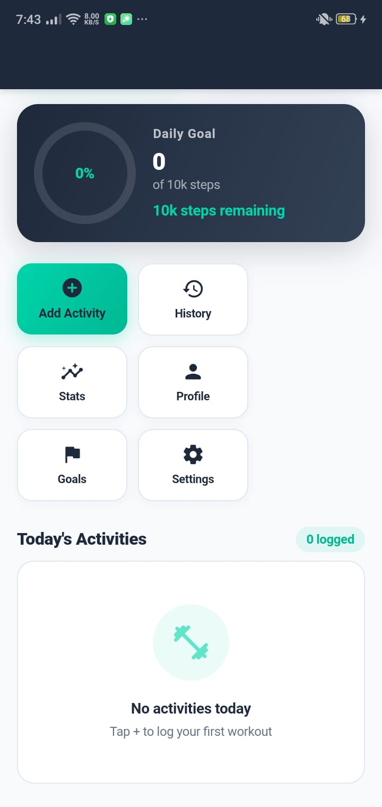
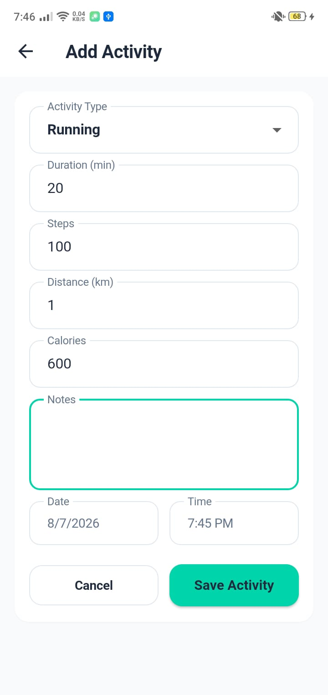
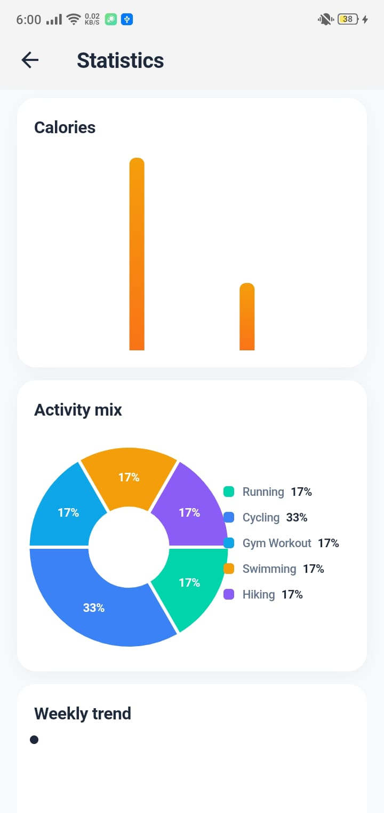
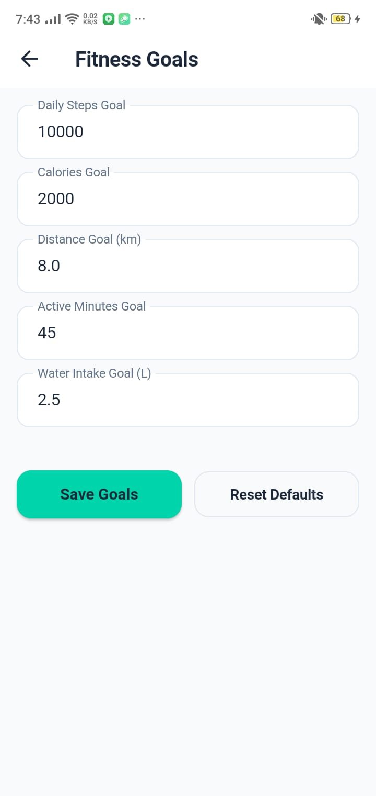
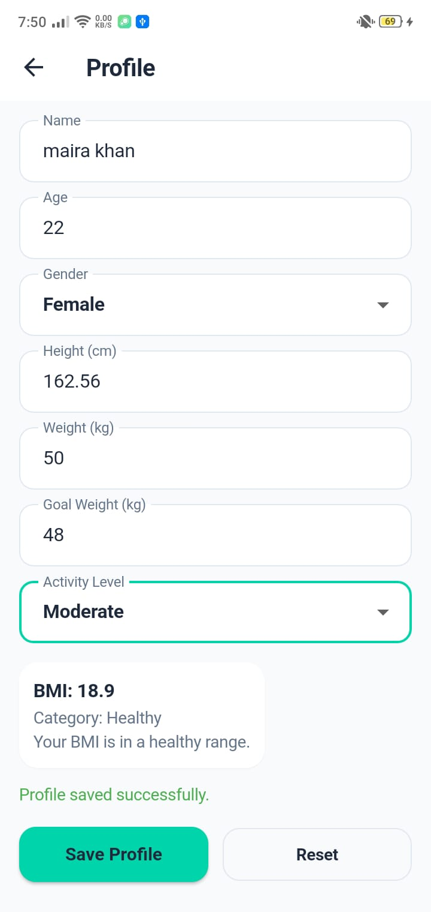
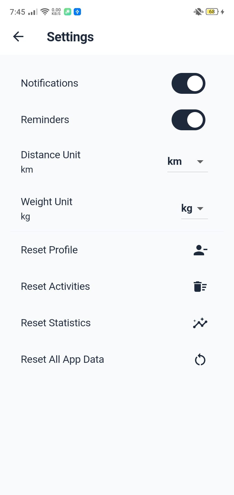

# 🏃 FitTrack Pro – Fitness Tracker App


---

# 📖 Project Overview

**FitTrack Pro** is a modern Fitness Tracker mobile application developed using **Flutter**. The application enables users to monitor their daily fitness activities, track progress, analyze workout statistics, manage personal goals, and maintain their fitness profile through a clean, responsive, and user-friendly interface.

The project follows **Clean Architecture**, **Feature-First Folder Structure**, **Repository Pattern**, and an **Offline-First** approach using **Drift (SQLite)** for local data persistence.

---

# ✨ Features

### 📊 Dashboard
- Daily fitness overview
- Activity summary
- Goal progress
- Quick actions
- Recent activities

### 🚶 Activity Tracking
- Add activity
- Edit activity
- Delete activity
- Track steps
- Track calories
- Track duration

### 📈 Statistics & Analytics
- Weekly statistics
- Activity distribution
- Steps analytics
- Calories analytics
- Performance insights

### 🎯 Goals
- Daily fitness goals
- Progress tracking
- Goal completion status

### 👤 Profile Management
- Personal information
- Height & weight
- Fitness preferences
- Profile editing

### ⚙️ Settings
- Application settings
- Theme preferences
- User preferences

---

# 🛠 Technology Stack

- Flutter
- Dart
- Riverpod
- Drift (SQLite)
- Go Router
- Material 3
- FL Chart

---

# 🏗 Architecture

The application is built using modern Flutter development practices.

- Clean Architecture
- Feature-First Folder Structure
- Repository Pattern
- SOLID Principles
- Dependency Injection
- Offline-First Database Design
- Riverpod State Management

---

# 📂 Project Structure

```text
lib/
│
├── core/
│   ├── constants/
│   ├── database/
│   ├── router/
│   ├── theme/
│   └── utils/
│
├── features/
│   ├── activity/
│   ├── dashboard/
│   ├── goals/
│   ├── profile/
│   ├── settings/
│   └── statistics/
│
├── shared/
│
└── main.dart

test/
│
├── dashboard/
├── activity/
├── statistics/
├── goals/
├── profile/
└── settings/
```

---

# 📸 Application Screenshots

| Dashboard | Activity |
|-----------|----------|
|  |  |

| Statistics | Goals |
|------------|-------|
|  |  |

| Profile | Settings |
|----------|----------|
|  |  |

---

# 🚀 Installation

## Clone Repository

```bash
git clone https://github.com/mairasarwar132/code-alpha.git
```

## Open Project

```bash
cd fitness_tracker
```

## Install Dependencies

```bash
flutter pub get
```

## Run Application

```bash
flutter run
```

---

# 🧪 Testing

Run Flutter Analyzer

```bash
flutter analyze
```

Run Unit & Widget Tests

```bash
flutter test
```

Project Verification

- Flutter Analyze: Passed
- Widget Tests: Passed
- Unit Tests: Passed
- Responsive UI: Verified
- Offline Database: Verified

---

# 📦 Packages Used

| Package | Purpose |
|----------|---------|
| flutter_riverpod | State Management |
| drift | Local SQLite Database |
| sqlite3_flutter_libs | SQLite Runtime |
| path_provider | Local Storage |
| go_router | Navigation |
| fl_chart | Charts & Analytics |

---

# 🎨 UI Highlights

- Modern Material 3 Design
- Responsive Layout
- Premium Dashboard
- Analytics Charts
- Goal Progress Cards
- Adaptive Components
- Clean User Interface
- Optimized User Experience

---

# 📁 Project Highlights

- Offline-First Application
- Local SQLite Storage
- Clean Architecture
- Modular Code Structure
- Scalable Project Design
- Responsive UI
- Feature-Based Development
- Production-Ready Folder Structure

---

# 👨‍💻 Developer

**Maira sarwar**

BS Information Technology

Flutter Developer

Superior University

Developed as part of the **CodeAlpha Flutter Development Internship**.

---

# 📄 License

This project is developed for educational purposes and submitted as part of the CodeAlpha Flutter Development Internship.